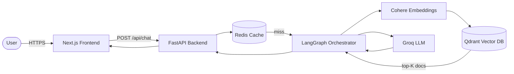

# Architecture Overview

TrojanChat 2.0 AI is a three-tier application: a **Next.js** frontend, a **FastAPI** backend, and an **AI pipeline** powered by LangGraph, Groq, Cohere, and Qdrant.

---

## High-Level Flow



---

## Component Responsibilities

| Component | Technology | Role |
|---|---|---|
| **Frontend** | Next.js 14, TypeScript | Chat UI, prompt suggestions, sidebar navigation |
| **API Layer** | FastAPI | Route handling, request validation, CORS |
| **Chat Service** | Python | Message storage, ID generation, history management |
| **RAG Orchestrator** | LangGraph | Step-wise retrieval → embedding → generation workflow |
| **Embedding Client** | Cohere | Converts query text into dense vectors |
| **Vector DB** | Qdrant | Stores and searches the USC football knowledge base |
| **LLM Client** | Groq | Generates the final natural-language response |
| **Inference Cache** | Redis | Short-circuits duplicate queries for lower latency |
| **WebSocket Layer** | FastAPI + asyncio | Real-time broadcast for future streaming responses |

---

## RAG Pipeline Detail

```
User Query
    │
    ▼
Cohere Embed (query → vector)
    │
    ▼
Qdrant Search (top-3 nearest docs)
    │
    ▼
Prompt Assembly (system prompt + retrieved context + query)
    │
    ▼
Groq Inference (llama3-8b-8192)
    │
    ▼
Response → Frontend
```

---

## Scalability Notes

- **Backend** is stateless and horizontally scalable behind any load balancer
- **Redis cache** (fail-open) reduces LLM calls by caching identical queries
- **Qdrant** can be swapped for a managed cluster for production scale
- **WebSocket manager** uses an asyncio lock to safely broadcast to concurrent connections

See [SYSTEM_DESIGN.md](SYSTEM_DESIGN.md) for a deeper scalability discussion.
