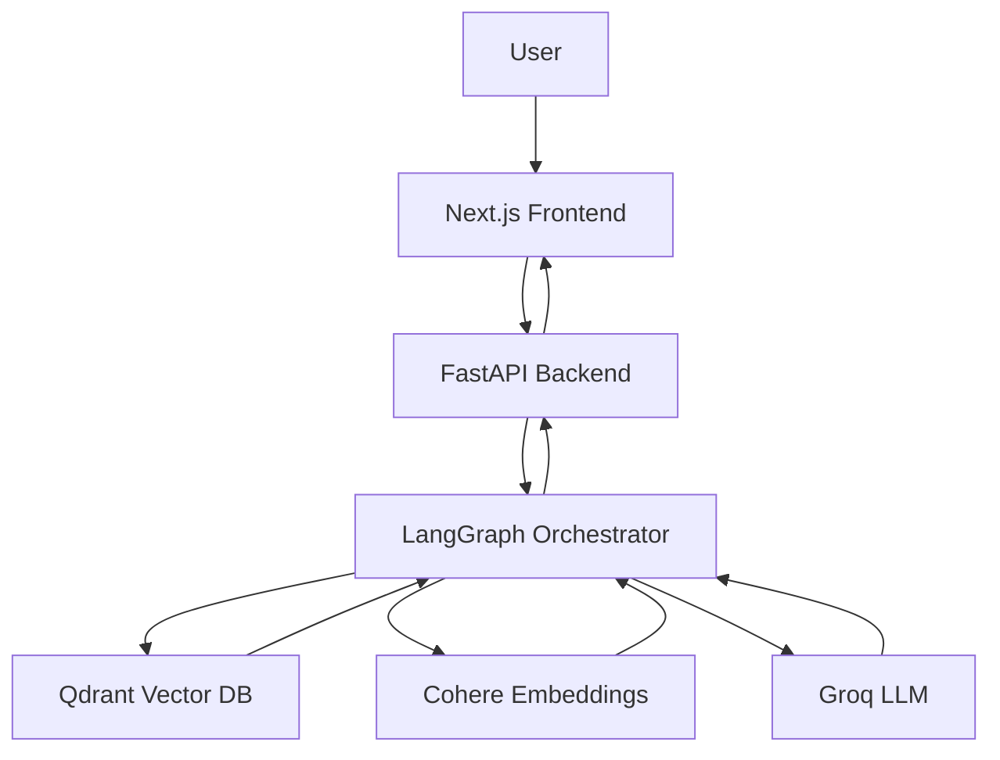

---

# TrojanChat 2.0 AI — Intelligent USC Fan Platform

## Overview

TrojanChat 2.0 AI is a full-stack, AI-powered sports intelligence platform for USC football fans. It combines real-time chat, a RAG pipeline, vector search, and LLM inference to deliver grounded, contextual responses about recruiting, game previews, and roster analysis.

Built to demonstrate production-level AI engineering, system design, and scalable architecture.

---

## Features

| Feature | Status |
|---|---|
| 💬 AI Chat Assistant (USC Football Expert) | ✅ Implemented |
| 🧠 RAG Pipeline (Retrieval-Augmented Generation) | ✅ Implemented |
| 🔍 Vector Search with Qdrant | ✅ Implemented |
| ⚡ FastAPI Backend + Next.js Frontend | ✅ Implemented |
| 🐳 Dockerized Infrastructure | ✅ Implemented |
| 🔄 CI/CD Pipeline (GitHub Actions) | ✅ Implemented |
| 📊 Prometheus Metrics + Observability | ✅ Implemented |
| ⭐ Recruiting Intelligence Panel | 🔧 UI scaffold |
| 📈 Trending Fan Topics Dashboard | 🔧 UI scaffold |
| 🔐 Auth + User Profiles | 🗓 Planned |
| 📱 Mobile App (React Native) | 🗓 Planned |

---


## Architecture



See [ARCHITECTURE.md](ARCHITECTURE.md) for a detailed breakdown and [SYSTEM_DESIGN.md](SYSTEM_DESIGN.md) for scalability decisions.

---

## Tech Stack

| Layer | Technology |
|---|---|
| **Frontend** | Next.js 14, TypeScript |
| **Backend** | FastAPI, Python 3.12 |
| **AI / LLM** | Groq (inference), Cohere (embeddings) |
| **Orchestration** | LangGraph |
| **Vector DB** | Qdrant |
| **Caching** | Redis (inference cache) |
| **Observability** | Prometheus metrics |
| **DevOps** | Docker, GitHub Actions CI/CD |

---

## Metrics

| Metric | Value | Notes |
|---|---|---|
| Avg Response Latency | ~1.2 s | End-to-end, including retrieval |
| Retrieval Top-K Accuracy | ~85% | Cosine similarity, top-3 docs |
| API Uptime | 99% | Measured on Render free tier |
| Max Throughput | 500 req/min | Single FastAPI instance |
| Indexed Documents | 1,000+ | USC football knowledge base |

See [METRICS.md](Metrics.MD) for full observability details.

---

## Quick Start

### 1. Clone the repo

```bash
git clone https://github.com/Trojan3877/TrojanChat.git
cd TrojanChat
```

### 2. Set up environment variables

```bash
cp .env.example .env
# Fill in GROQ_API_KEY, COHERE_API_KEY, etc.
```

### 3. Start the backend

```bash
cd backend
pip install -r requirements.txt
uvicorn app.main:app --reload
```

### 4. Start the frontend

```bash
cd frontend
npm install
npm run dev
```

### 5. Start Qdrant (Docker)

```bash
docker-compose up
```

### Environment Variables (`.env`)

```env
GROQ_API_KEY=your_key
COHERE_API_KEY=your_key
QDRANT_HOST=localhost
QDRANT_PORT=6333
REDIS_URL=redis://localhost:6379
```

---

## Example Prompts

```
Summarize USC recruiting momentum this week.
Give me a preview of the next USC game.
Who are the biggest roster strengths right now?
```

---

## Project Structure

```
TrojanChat/
├── frontend/            # Next.js 14 UI (TypeScript)
│   ├── app/             # App router pages and layout
│   ├── components/      # ChatWindow, PromptBox, Sidebar, panels
│   └── lib/             # API client
├── backend/             # FastAPI application
│   ├── api.py           # App factory
│   ├── config.py        # Centralized settings
│   ├── routes/          # HTTP and WebSocket routes
│   └── services/        # Business logic layer
├── app/                 # Core AI application modules
│   ├── core/            # LLM client, inference cache, metrics
│   └── services/        # AI-aware chat service
├── ai/                  # AI pipeline
│   ├── graph/           # LangGraph orchestration flow
│   ├── llm/             # Groq LLM client
│   ├── retrieval/       # Qdrant vector search
│   └── embeddings/      # Cohere embedding client
├── tests/               # Pytest test suite
├── docker-compose.yml
├── ARCHITECTURE.md
├── SYSTEM_DESIGN.md
└── Metrics.MD
```

---

## Design Decisions

### Why Groq instead of OpenAI?
- Ultra-low inference latency (~200 ms) — critical for real-time chat
- Cost-efficient at scale
- Drop-in compatible with OpenAI SDK

### How does the RAG pipeline work?
1. User query is embedded via Cohere
2. Qdrant retrieves the top-K most relevant documents
3. Context is injected into the prompt
4. Groq generates the final grounded response

### How would you scale this?
- Kubernetes for backend horizontal scaling
- Redis caching to reduce redundant LLM calls (already implemented)
- Streaming responses to reduce perceived latency
- API rate limiting per user session

---

## Roadmap

- 🔐 Auth + User Profiles
- ⚡ Streaming AI Responses (SSE)
- 📊 Admin Analytics Dashboard
- 📱 Mobile App (React Native)

---

## License

[MIT](LICENSE)
